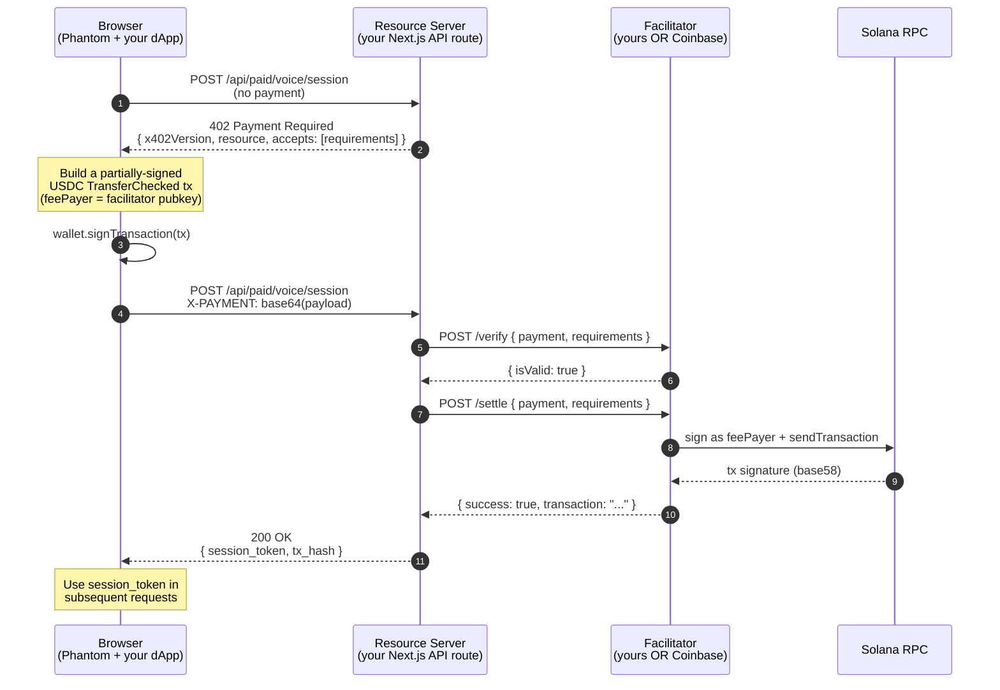
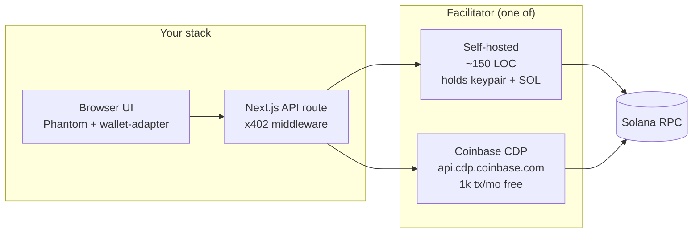
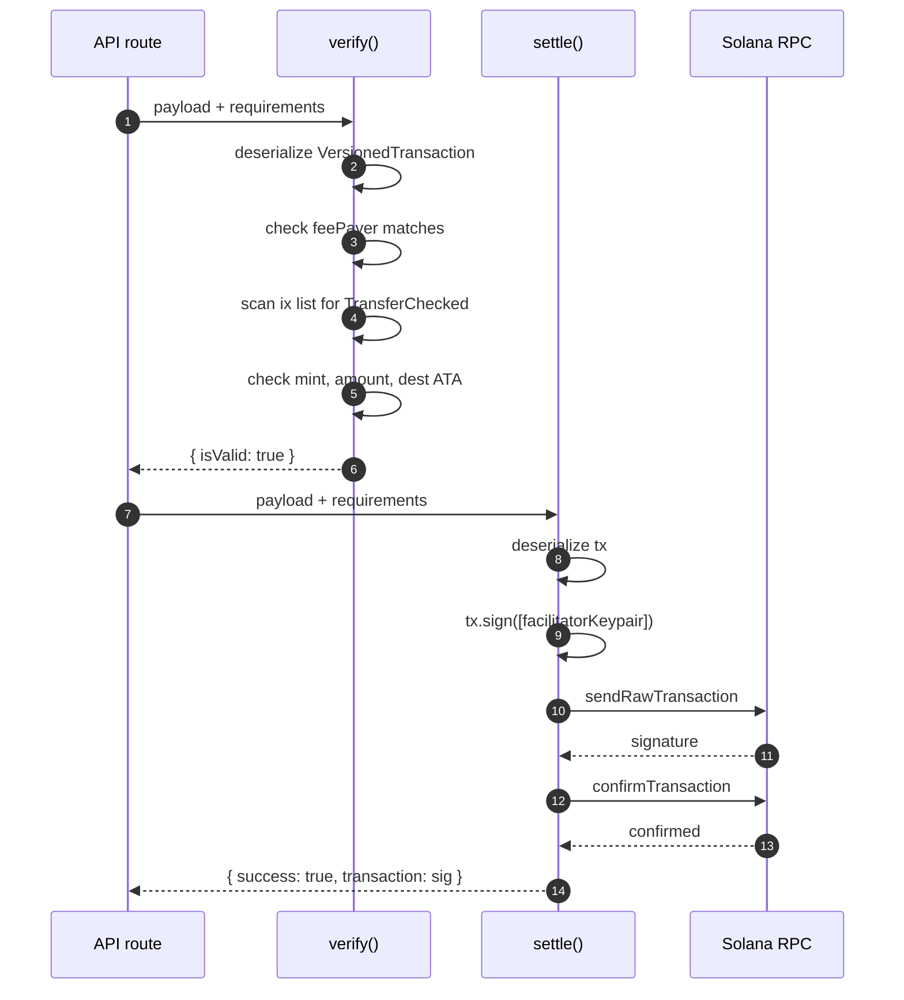
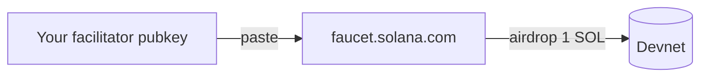
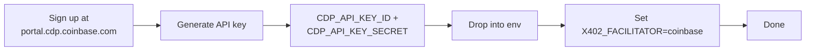

# Solana x402 — A Hackathon Field Guide

A working developer's guide to gating an HTTP API behind a USDC payment on Solana. Written from notes taken while wiring it up end-to-end into a real Next.js app — every gotcha here is one we actually hit.

---

## TL;DR

- **x402** is "HTTP 402 Payment Required, but for real now" — a tiny protocol on top of normal HTTP that lets a server demand a crypto payment before serving content.
- On Solana with USDC: you ask for content → server returns `402` with payment requirements → you sign an SPL-token transfer → retry with an `X-PAYMENT` header → server (via a **facilitator**) co-signs as fee payer, broadcasts, and serves the content.
- A **facilitator** is the piece that holds SOL for tx fees and broadcasts on-chain. You can run your own (~150 LOC) or use a hosted one (Coinbase CDP).
- **Devnet works free**: faucet SOL + faucet USDC-Dev → smoke-test the whole flow without spending a cent.

---

## 1. What is x402?

x402 reanimates the long-unused HTTP `402 Payment Required` status code as a real-world payment protocol. Coinbase's Developer Platform shipped the v2 spec in early 2026; the design intent is "stripe-style micropayments without the merchant accounts."

The protocol is:

- **Stateless** — no sessions, no API keys
- **HTTP-native** — works through any normal CDN / load balancer
- **Chain-agnostic** — same wire format for EVM (USDC on Base) and Solana (USDC SPL)
- **Cheap** — Solana finality ~400 ms, fees ~$0.00025

The killer use cases: paid agent calls, paywalled APIs, voice/AI minutes, content microtransactions.

Spec lives at [github.com/coinbase/x402](https://github.com/coinbase/x402).

---

## 2. The handshake (sequence diagram)



Two HTTP round-trips: probe → pay-and-retry. Settlement happens server-side, client just sees a 200.

---

## 3. The wire format

### Server's 402 response body

```json
{
  "x402Version": 2,
  "resource": {
    "url": "https://example.com/api/paid/your-resource",
    "description": "Access to a paid resource",
    "mimeType": "application/json"
  },
  "accepts": [
    {
      "scheme": "exact",
      "network": "solana:EtWTRABZaYq6iMfeYKouRu166VU2xqa1",
      "amount": "10000",
      "asset": "4zMMC9srt5Ri5X14GAgXhaHii3GnPAEERYPJgZJDncDU",
      "payTo": "<your-recipient-pubkey>",
      "maxTimeoutSeconds": 60,
      "extra": {
        "feePayer": "<facilitator-pubkey>"
      }
    }
  ]
}
```

- `network` is **CAIP-2** form: `solana:<first 32 chars of genesis hash>` — devnet has its own ID, see [section 7](#7-network-identifiers).
- `amount` is a **string** of smallest units (USDC has 6 decimals, so `10000` = $0.01).
- `asset` is the SPL **mint address**.
- `payTo` is the recipient's base58 wallet pubkey (NOT their token account — the facilitator derives the ATA).
- `extra.feePayer` is what the facilitator returns when you call its `/supported` endpoint. You bake it into the tx so the user doesn't need SOL to pay gas.

### Client's `X-PAYMENT` header

The header value is `base64(JSON.stringify(payload))` where payload is:

```json
{
  "x402Version": 2,
  "resource": { ...echoed back from 402... },
  "accepted": { ...the requirements you accepted... },
  "payload": {
    "transaction": "<base64-encoded VersionedTransaction>"
  }
}
```

The `transaction` is a **partially-signed** `VersionedTransaction`:

- Account `[0]` (the fee payer slot) is the facilitator's pubkey, with **no signature yet**
- The user has signed as a non-fee-payer signer
- The facilitator co-signs and broadcasts

### Required transaction structure

Per spec the **third instruction (index 2) MUST be `TransferChecked`** for the SPL token. Other slots are flexible. A practical shape:

| Index | Instruction | Why |
|---|---|---|
| 0 | `ComputeBudget.setComputeUnitLimit` | Reserve compute headroom |
| 1 | `createAssociatedTokenAccountIdempotent` | Auto-create recipient ATA on first payment (no-op if exists) |
| 2 | `TransferChecked` (SPL) | The actual payment |

> ⚠️ **Phantom (and some other wallets) inject their own priority-fee `ComputeBudget` ix at index 0 when they sign.** Your verifier should **scan all instructions for TransferChecked**, not hardcode `instructions[2]`. We learned this the painful way.

---

## 4. The facilitator: hosted vs self-hosted

A facilitator does three jobs:

1. **Verify** the payment payload off-chain (signature, amount, recipient, mint)
2. **Co-sign** as fee payer (its keypair holds SOL for gas)
3. **Broadcast** the transaction and report the txid



### Comparison

| | Self-hosted | Coinbase CDP (hosted) | Rapid402 (hosted) |
|---|---|---|---|
| Setup cost | Generate keypair, fund SOL | Sign up at [portal.cdp.coinbase.com](https://portal.cdp.coinbase.com) | Use [rapid402.com](https://rapid402.com) |
| Ongoing cost | SOL gas (~$0.00025/tx) | 1k tx/mo free, then $0.001/tx | Ad-hoc |
| Vendor lock-in | None | CDP account | Rapid402 account |
| Operational burden | Monitor SOL balance, RPC reliability | None | None |
| Production ready | Yes (with monitoring) | Yes | At time of writing rapid402.com endpoint was unreachable — verify before betting on it |
| Solana-native | Yes | Yes (one of many networks) | Yes |
| Best for | Hackathons, full control, Solana-only apps | Cross-chain apps, no-ops projects | Solana-purist preference |

**Hackathon recommendation:** start self-hosted on devnet, swap to Coinbase via env var if you need cross-chain or want to outsource ops. Architect the facilitator behind an interface so swapping is a one-file change (see [section 9](#9-architecting-for-swap-ability)).

### Self-hosted: what it actually does



### Hosted: what changes

The same interface, but `verify` and `settle` are HTTP calls to Coinbase:

```
POST https://api.cdp.coinbase.com/platform/v2/x402/verify
POST https://api.cdp.coinbase.com/platform/v2/x402/settle
```

Auth is an `Authorization: Bearer <jwt>` header where the JWT is signed with **ES256** using your CDP API secret (a PEM-formatted EC private key).

---

## 5. Step-by-step: build your first x402 endpoint (self-hosted, devnet)

### 5.1 Generate a facilitator keypair

```js
// scripts/x402-setup.mjs
import { Keypair } from '@solana/web3.js';
import bs58 from 'bs58';
import crypto from 'node:crypto';

const kp = Keypair.generate();
console.log('FACILITATOR_KEYPAIR_SECRET=', bs58.encode(kp.secretKey));
console.log('X402_SESSION_JWT_SECRET=', crypto.randomBytes(48).toString('base64'));
console.log('Pubkey (fund this with SOL):', kp.publicKey.toBase58());
```

Run once. Save the secret base58 string in `.env.local`.

### 5.2 Fund the facilitator with devnet SOL



The CLI airdrop is rate-limited from most IPs (`429 You've reached your airdrop limit`). Use **[faucet.solana.com](https://faucet.solana.com/)** with GitHub login — it's the most reliable.

Verify:
```bash
curl -X POST https://api.devnet.solana.com -H "Content-Type: application/json" \
  -d '{"jsonrpc":"2.0","id":1,"method":"getBalance","params":["<your-pubkey>"]}'
```

### 5.3 Get the user some devnet USDC

The user's wallet (the one signing in Phantom) needs a USDC ATA with enough balance to send. Easiest: faucet.

> 🚨 **Mint mismatch is the #1 mistake.** Your code's `asset` field MUST be the same mint that the faucet gave the user. We use `4zMMC9srt5Ri5X14GAgXhaHii3GnPAEERYPJgZJDncDU` (Circle's official devnet USDC).

Use **[faucet.circle.com](https://faucet.circle.com/)** — pick "Solana", paste your wallet, get ~10 USDC at the right mint.

Other faucets like [spl-token-faucet.com](https://spl-token-faucet.com) hand out a *different* USDC-Dev mint (`Gh9ZwEmdLJ8DscKNTkTqPbNwLNNBjuSzaG9Vp2KGtKJr`) — works fine if you change your `asset` constant to match.

### 5.4 Switch Phantom to Devnet

Phantom: Settings → Developer Settings → enable Testnet Mode → network selector → **Devnet** (not Testnet — those are different networks).

### 5.5 Build the client-side payment

```ts
import {
  ComputeBudgetProgram, Connection, PublicKey,
  TransactionMessage, VersionedTransaction,
} from '@solana/web3.js';
import {
  TOKEN_PROGRAM_ID,
  createAssociatedTokenAccountIdempotentInstruction,
  createTransferCheckedInstruction,
  getAssociatedTokenAddressSync,
} from '@solana/spl-token';

async function buildPayment(connection, wallet, requirements) {
  const userPubkey = wallet.publicKey;
  const feePayer = new PublicKey(requirements.extra.feePayer);
  const recipient = new PublicKey(requirements.payTo);
  const mint = new PublicKey(requirements.asset);
  const amount = BigInt(requirements.amount);

  const sourceAta = getAssociatedTokenAddressSync(mint, userPubkey);
  const destAta = getAssociatedTokenAddressSync(mint, recipient);

  const ix = [
    ComputeBudgetProgram.setComputeUnitLimit({ units: 200_000 }),
    createAssociatedTokenAccountIdempotentInstruction(
      feePayer, destAta, recipient, mint, TOKEN_PROGRAM_ID,
    ),
    createTransferCheckedInstruction(
      sourceAta, mint, destAta, userPubkey,
      amount, 6 /* USDC decimals */, [], TOKEN_PROGRAM_ID,
    ),
  ];

  const { blockhash } = await connection.getLatestBlockhash('finalized');
  const message = new TransactionMessage({
    payerKey: feePayer,           // facilitator pays gas
    recentBlockhash: blockhash,
    instructions: ix,
  }).compileToV0Message();

  const tx = new VersionedTransaction(message);
  const signed = await wallet.signTransaction(tx);  // partial sig
  return Buffer.from(signed.serialize()).toString('base64');
}
```

### 5.6 The X-PAYMENT envelope

```ts
const xPayment = btoa(JSON.stringify({
  x402Version: 2,
  resource: body.resource,           // echoed from the 402 response
  accepted: requirements,            // the one we picked
  payload: { transaction },          // the base64 from buildPayment()
}));

const res = await fetch('/api/paid/voice/session', {
  method: 'POST',
  headers: { 'X-PAYMENT': xPayment },
});
```

### 5.7 Server-side verify + settle

```ts
// /api/paid/voice/session/route.ts (Next.js)
import { NextResponse } from 'next/server';

export async function POST(req) {
  const facilitator = createFacilitator();           // see §9
  const feePayer = await facilitator.getFeePayer();
  const requirements = buildRequirements(feePayer);

  const xPayment = req.headers.get('x-payment');
  if (!xPayment) {
    return NextResponse.json(
      { x402Version: 2, resource: {...}, accepts: [requirements] },
      { status: 402 },
    );
  }

  const payload = JSON.parse(atob(xPayment));
  const v = await facilitator.verify(payload, requirements);
  if (!v.isValid) return NextResponse.json({ error: v.invalidReason }, { status: 402 });

  const s = await facilitator.settle(payload, requirements);
  if (!s.success) return NextResponse.json({ error: s.error }, { status: 502 });

  // Mint your session JWT, redirect, serve content — whatever your "paid"
  // resource actually is. We mint a 10-min single-use JWT here.
  return NextResponse.json({ session_token: ..., tx_hash: s.transaction });
}
```

### 5.8 Self-hosted facilitator implementation

The whole verifier+settler in ~150 LOC:

```ts
import { Connection, Keypair, PublicKey, VersionedTransaction } from '@solana/web3.js';
import { TOKEN_PROGRAM_ID, getAssociatedTokenAddressSync } from '@solana/spl-token';
import bs58 from 'bs58';

export class SelfHostedFacilitator {
  private connection: Connection;
  private key: Keypair;

  constructor(rpcUrl: string, secretBase58: string) {
    this.connection = new Connection(rpcUrl, 'confirmed');
    this.key = Keypair.fromSecretKey(bs58.decode(secretBase58));
  }

  getFeePayer = async () => this.key.publicKey.toBase58();

  async verify(payment, req) {
    const tx = VersionedTransaction.deserialize(
      Buffer.from(payment.payload.transaction, 'base64'),
    );
    const accountKeys = tx.message.staticAccountKeys;

    // 1. feePayer must be us
    if (accountKeys[0].toBase58() !== this.key.publicKey.toBase58()) {
      return { isValid: false, invalidReason: 'wrong feePayer' };
    }

    // 2. Find TransferChecked anywhere (Phantom may inject ix at index 0)
    const ixIdx = tx.message.compiledInstructions.findIndex(ix => {
      const pid = accountKeys[ix.programIdIndex];
      return pid.equals(TOKEN_PROGRAM_ID) && ix.data[0] === 12; // discriminator 12 = TransferChecked
    });
    if (ixIdx === -1) return { isValid: false, invalidReason: 'no TransferChecked' };

    const ix = tx.message.compiledInstructions[ixIdx];
    const data = Buffer.from(ix.data);
    const amount = data.readBigUInt64LE(1);
    if (amount !== BigInt(req.amount)) return { isValid: false, invalidReason: 'wrong amount' };

    // accounts: [source, mint, dest, owner]
    const mint = accountKeys[ix.accountKeyIndexes[1]].toBase58();
    const dest = accountKeys[ix.accountKeyIndexes[2]].toBase58();
    if (mint !== req.asset) return { isValid: false, invalidReason: 'wrong mint' };

    const expectedDest = getAssociatedTokenAddressSync(
      new PublicKey(req.asset), new PublicKey(req.payTo),
    ).toBase58();
    if (dest !== expectedDest) return { isValid: false, invalidReason: 'wrong dest ATA' };

    return { isValid: true };
  }

  async settle(payment, req) {
    const tx = VersionedTransaction.deserialize(
      Buffer.from(payment.payload.transaction, 'base64'),
    );
    tx.sign([this.key]);                               // co-sign as feePayer
    const sig = await this.connection.sendRawTransaction(tx.serialize());
    await this.connection.confirmTransaction(sig, 'confirmed');
    return {
      success: true,
      transaction: sig,
      network: req.network,
      payer: this.key.publicKey.toBase58(),
    };
  }
}
```

That's the whole thing. Real-world hardening: nonce/JTI dedup, blockhash freshness check, replay protection (each TransferChecked has a unique recent blockhash so this is largely free), monitoring on facilitator SOL balance.

---

## 6. Going hosted: Coinbase CDP



The CDP key secret is a PEM-formatted EC private key. Auth is per-request ES256 JWTs:

```ts
import { SignJWT, importPKCS8 } from 'jose';

const key = await importPKCS8(process.env.CDP_API_KEY_SECRET, 'ES256');
const auth = await new SignJWT({
    iss: 'cdp',
    aud: ['cdp_service'],
    uri: `POST api.cdp.coinbase.com/platform/v2/x402/verify`,
  })
  .setProtectedHeader({ alg: 'ES256', kid: process.env.CDP_API_KEY_ID, typ: 'JWT' })
  .setSubject(process.env.CDP_API_KEY_ID)
  .setIssuedAt()
  .setExpirationTime('120s')
  .sign(key);

const res = await fetch('https://api.cdp.coinbase.com/platform/v2/x402/verify', {
  method: 'POST',
  headers: { Authorization: `Bearer ${auth}`, 'Content-Type': 'application/json' },
  body: JSON.stringify({ paymentPayload, paymentRequirements }),
});
```

The verify/settle JSON shapes match the self-hosted interface — Coinbase publishes the spec, after all.

---

## 7. Network identifiers

x402 uses **CAIP-2** for chain identification: `<chain>:<reference>`. For Solana, `<reference>` is the first 32 chars of the genesis hash.

| Network | CAIP-2 ID | RPC URL |
|---|---|---|
| Solana Mainnet | `solana:5eykt4UsFv8P8NJdTREpY1vzqKqZKvdp` | https://api.mainnet-beta.solana.com (rate-limited; use Helius/Triton/QuickNode in prod) |
| Solana Devnet | `solana:EtWTRABZaYq6iMfeYKouRu166VU2xqa1` | https://api.devnet.solana.com |
| Solana Testnet | `solana:4uhcVJyU9pJkvQyS88uRDiswHXSCkY3z` | https://api.testnet.solana.com (rarely useful — devnet is what you want) |

---

## 8. Token mint addresses (USDC)

| Token | Network | Mint Address | Decimals |
|---|---|---|---|
| USDC | Solana Mainnet | `EPjFWdd5AufqSSqeM2qN1xzybapC8G4wEGGkZwyTDt1v` | 6 |
| USDC (Circle Dev) | Solana Devnet | `4zMMC9srt5Ri5X14GAgXhaHii3GnPAEERYPJgZJDncDU` | 6 |
| USDC-Dev (spl-token-faucet variant) | Solana Devnet | `Gh9ZwEmdLJ8DscKNTkTqPbNwLNNBjuSzaG9Vp2KGtKJr` | 6 |
| USDT | Solana Mainnet | `Es9vMFrzaCERmJfrF4H2FYD4KCoNkY11McCe8BenwNYB` | 6 |

Pick **one** USDC mint and use it everywhere. `payTo`'s ATA is *derived* from `(mint, owner)` so the wrong mint = wrong ATA = transfer rejects with `invalid account data for instruction`.

---

## 9. Architecting for swap-ability

Hide the facilitator behind an interface so you can change vendors without touching business logic.

```ts
// lib/facilitator/types.ts
export interface FacilitatorClient {
  verify(payment: PaymentPayload, req: PaymentRequirements): Promise<VerifyResult>;
  settle(payment: PaymentPayload, req: PaymentRequirements): Promise<SettleResult>;
  getFeePayer(): Promise<string>;
}

// lib/facilitator/index.ts
export function createFacilitator(): FacilitatorClient {
  switch (process.env.X402_FACILITATOR) {
    case 'coinbase': return new CoinbaseFacilitator({...});
    case 'self':     return new SelfHostedFacilitator(rpc, secret);
    default:         throw new Error('X402_FACILITATOR not set');
  }
}
```

Every consumer gets `createFacilitator()` and never knows which vendor they're talking to. Swap is an env var.

---

## 10. Faucets cheat sheet

### Devnet SOL (for facilitator gas)

| | URL | Notes |
|---|---|---|
| **faucet.solana.com** ⭐ | https://faucet.solana.com | Most reliable. GitHub login, captcha. Pick Devnet, paste pubkey. |
| RPC airdrop | `curl -X POST https://api.devnet.solana.com -d '{"jsonrpc":"2.0","method":"requestAirdrop",...}'` | Rate-limited per IP (`429`). Try once, fall back to web faucet. |
| Helius faucet | https://www.helius.dev/devnet-faucet | Backup. Sign up free. |
| QuickNode faucet | https://faucet.quicknode.com | Backup. Free. |

### Devnet USDC (for the buyer)

| | URL | Mint it gives | Notes |
|---|---|---|---|
| **Circle official** ⭐ | https://faucet.circle.com | `4zMMC9srt...` | Match our `asset`. ~10 USDC per request. |
| spl-token-faucet | https://spl-token-faucet.com | `Gh9ZwEmd...` | *Different* mint — only use if your `asset` matches it. |

### Devnet explorer

- [explorer.solana.com](https://explorer.solana.com/?cluster=devnet) — paste a tx signature or address, set cluster to Devnet
- [solscan.io](https://solscan.io) — toggle network in the top-right
- [solana.fm](https://solana.fm) — clean UX

---

## 11. Common pitfalls (we hit all of these)

| Symptom | Cause | Fix |
|---|---|---|
| `Attempt to debit an account but found no record of a prior credit` | Facilitator (account[0]) has 0 SOL on the active network | Fund the **facilitator** pubkey with SOL on the correct network. Devnet and mainnet are separate ledgers — funding devnet doesn't help mainnet. |
| `failed to get recent blockhash: 403 Access forbidden` (in browser console) | `NEXT_PUBLIC_SOLANA_RPC_URL` points at `api.mainnet-beta.solana.com` — Solana Labs blocks browser dApps from that endpoint | **Use a paid RPC for mainnet** (Helius, Triton, QuickNode). The public mainnet RPC is for backend tooling only — never put it in `NEXT_PUBLIC_*`. |
| `Transaction simulation failed: insufficient funds` from SPL Token program | Phantom is on a different network than your dApp expects (e.g. Phantom on Devnet, dApp on Mainnet — same buyer pubkey but different USDC balance per ledger) | Switch Phantom: gear icon → Developer Settings → Testnet Mode → set network to match `NEXT_PUBLIC_SOLANA_NETWORK` |
| `Error processing Instruction 2: invalid account data for instruction` from Token program | Source ATA doesn't exist (user has no USDC for this mint) OR wrong mint | User must hold the *exact* USDC mint your code expects. Match faucet → mint. |
| `instruction[2] is not an SPL token program instruction` (your own verify code) | Phantom prepended a priority-fee `ComputeBudget` ix when signing, shifting your TransferChecked from index 2 to 3 | **Scan all instructions** for TransferChecked; don't hardcode index 2 |
| Phantom shows "This dApp could be malicious" + "domain is new" warnings | Phantom blocklist hasn't seen this domain yet — fires for any fresh dApp | Click "Proceed anyway (unsafe)". Email `review@phantom.com` to expedite domain review for production. |
| Phantom shows "You don't have enough SOL" when user is *not* the fee payer | Phantom's pre-flight balance check sees the **facilitator** has 0 SOL on the active network and surfaces it as a generic warning | Fund the facilitator (not the buyer) with SOL on the network you're operating on |
| You funded the wrong wallet — facilitator still 0 SOL | Easy to confuse buyer / recipient / facilitator | **Three wallets, three roles** — see the [mainnet wallet table](#three-wallet-roles) below. Only the **facilitator** needs SOL. |
| `Wallet does not support signTransaction` | Browser wallet adapter not connected, or wallet doesn't implement the Wallet Standard | Make sure the wallet shows as "connected" before triggering payment |
| Facilitator's settle fails with `Blockhash not found` | Tx took too long between client-sign and server-broadcast | Use `'finalized'` for `getLatestBlockhash` on the client; settle promptly |
| Recipient ATA doesn't exist | First payment to a fresh address | Include `createAssociatedTokenAccountIdempotentInstruction` BEFORE the TransferChecked, with feePayer as payer |
| Wallet adapter meta-package crashes Next.js hydration | `@solana/wallet-adapter-wallets` drags in 30+ legacy adapters with React-16 peer deps | Pass `wallets={[]}` — Phantom/Solflare/Backpack auto-register via Wallet Standard |
| Deepgram transcribes "x402" as "x four zero two" | Deepgram's default formatting spells digits out as words | Pass `smart_format=True` to the Deepgram STT plugin. Also formats "ERC20" correctly, capitalizes proper nouns, adds punctuation. |
| Deepgram crashes with `keyterms only available for English` when language=fr | Nova-3's `keyterms` parameter is English-only | Conditionally pass `keyterms` only when language starts with `en`; for other languages the base model handles loanwords fine |
| `Cannot find matching keyid` from corepack | Node 22.13 ships with stale signing keys | `COREPACK_INTEGRITY_KEYS=0 pnpm install` |

---

## 12. Going to mainnet

> ⚠️ **The single most important thing**: you **MUST** use a paid RPC provider for mainnet. The public endpoint `https://api.mainnet-beta.solana.com` actively 403s browser dApp requests — it's for backend tooling only. Helius's free tier (100k credits/month) is more than enough. Spend 5 minutes signing up before anything else.

### Three-wallet roles

Before flipping anything, internalize which wallet does what — confusing them is the #1 source of "why isn't this working" pain when going to mainnet:

| Role | Address source | Needs (on mainnet) | Example value |
|---|---|---|---|
| **Facilitator** (pays Solana network fees) | `FACILITATOR_KEYPAIR_SECRET` env var → derived pubkey | **SOL** (~0.01 SOL covers thousands of settlements) | `2ubcwWMd...` |
| **Buyer** (the person paying) | The wallet currently active in their Phantom | USDC (the actual payment) | varies per user |
| **Recipient** (where USDC lands) | `SOLANA_RECIPIENT_ADDRESS` env var | **nothing** — just receives USDC | your treasury / Phantom |

If a payment fails with "insufficient funds" or "no prior credit", check this table — almost always the wrong wallet got funded.

### Step-by-step mainnet flip

**1. Sign up for Helius** at [helius.dev](https://www.helius.dev/) → copy your mainnet endpoint URL (looks like `https://mainnet.helius-rpc.com/?api-key=YOUR_KEY`).

**2. Generate a fresh facilitator keypair for mainnet** — don't reuse the devnet one:

```sh
node scripts/x402-setup.mjs   # in our repo, or equivalent
```

Save the printed `FACILITATOR_KEYPAIR_SECRET` and pubkey. Back the secret up to a password manager.

**3. Fund the new facilitator pubkey with mainnet SOL** — buy SOL on Coinbase/Kraken/etc., withdraw to that pubkey on the Solana network. ~0.01 SOL ($2-3) is plenty. **Verify the address character-by-character — wrong network or wrong address = funds lost.**

**4. Update env vars** (Vercel project settings, or wherever you host):

```diff
- NEXT_PUBLIC_SOLANA_NETWORK=devnet
- NEXT_PUBLIC_SOLANA_RPC_URL=https://api.devnet.solana.com
- SOLANA_RPC_URL=https://api.devnet.solana.com
- FACILITATOR_KEYPAIR_SECRET=<old devnet secret>
+ NEXT_PUBLIC_SOLANA_NETWORK=mainnet
+ NEXT_PUBLIC_SOLANA_RPC_URL=https://mainnet.helius-rpc.com/?api-key=YOUR_KEY
+ SOLANA_RPC_URL=https://mainnet.helius-rpc.com/?api-key=YOUR_KEY
+ FACILITATOR_KEYPAIR_SECRET=<new mainnet secret from step 2>
```

Set `SOLANA_RECIPIENT_ADDRESS` to the wallet (or multisig) you actually want to receive payments.

**5. Redeploy.** `NEXT_PUBLIC_*` vars are baked into the JS bundle at build time, so saving alone doesn't apply them — trigger a fresh build/deploy after editing.

**6. Verify with a small test transaction.** In Phantom, switch network to **Mainnet** (Settings → Developer Settings → off, or just confirm the network indicator). Have a small amount of mainnet USDC. Walk through the payment flow on the deployed site. Check the resulting tx hash on [solscan.io](https://solscan.io) — you should see the facilitator co-signing as fee payer and your USDC moving to the recipient.

### Optional but worth the small effort: split the RPC URL

The `NEXT_PUBLIC_SOLANA_RPC_URL` is baked into the browser bundle, which means **anyone viewing your site can extract your Helius API key from the JS** and use your paid quota. Mitigation:

```env
# Public, baked into browser — use the free public endpoint (browser only does light reads)
NEXT_PUBLIC_SOLANA_RPC_URL=https://api.mainnet-beta.solana.com

# Server-only, your paid Helius key — never reaches the browser
SOLANA_RPC_URL=https://mainnet.helius-rpc.com/?api-key=YOUR_KEY
```

Wait — but the public RPC 403s browser POSTs! True. The wallet adapter only does a few reads (blockhash, balance), and those generally still work when called from a browser sometimes... actually, Solana Labs has tightened this. **In practice, you'll need a paid RPC for the browser too.** Either:
- Use the same Helius URL on both (key is exposed but free tier is fine if you're okay with that), OR
- Set up an Helius restricted-domain key for the public side (you can configure Helius to only accept requests from your domain, which limits abuse)

Pragmatic recommendation: same Helius URL on both for hackathon/MVP. Set up domain restrictions in the Helius dashboard for production.

### Mainnet operational checklist

- [ ] Fresh facilitator keypair (not the devnet one)
- [ ] Facilitator keypair backed up to a password manager
- [ ] Monitoring on facilitator SOL balance — alert when < 0.005 SOL
- [ ] Rate-limiting on the paid endpoint (1 tx per IP per minute via Vercel middleware or Cloudflare)
- [ ] Replay protection (we mint single-use JWTs; persist consumed JTIs to a database for multi-instance deploys — in-memory dedup only works on a single Vercel function instance)
- [ ] Logging tx hashes on every settle for accounting reconciliation
- [ ] Helius API key restricted to your production domain (Helius dashboard → API Key → Allowed Origins)
- [ ] Recipient address is a multisig (Squads, etc.) for any meaningful revenue
- [ ] Phantom domain review — email `review@phantom.com` so the "malicious dApp" warning goes away for users on day 1

---

## 13. The full env var reference

```bash
# x402 facilitator selection
X402_FACILITATOR=self                                    # "self" or "coinbase"

# Solana RPC + network
NEXT_PUBLIC_SOLANA_NETWORK=devnet                        # "devnet" or "mainnet"
NEXT_PUBLIC_SOLANA_RPC_URL=https://api.devnet.solana.com
SOLANA_RPC_URL=https://api.devnet.solana.com

# Where payments land
SOLANA_RECIPIENT_ADDRESS=<your-base58-wallet>

# Self-hosted facilitator
FACILITATOR_KEYPAIR_SECRET=<base58-secret-key>           # generate via setup script

# Coinbase facilitator (alternative)
CDP_API_KEY_ID=<from portal.cdp.coinbase.com>
CDP_API_KEY_SECRET=<PEM-formatted EC private key>

# Session JWT (the thing you mint after a successful payment)
X402_SESSION_JWT_SECRET=<random 48 bytes, base64>

# Pricing
NEXT_PUBLIC_PAYMENT_DEFAULT_AMOUNT=0.01                  # USD
```

---

## 14. Why HTTP 402, why now?

The 402 status code was reserved in HTTP/1.0 (RFC 1945, 1996) but never standardized — it's been "Payment Required" in name only for ~30 years. Two things changed:

1. **Stablecoins on fast L2/L1s** make sub-cent payments physically possible. ~~That used to require a Visa-grade rail.~~
2. **Agents** want to pay for API calls programmatically. Stripe needs human-in-the-loop merchant accounts; agents can't sign contracts.

x402 is the cleanest answer to "how does an LLM pay for an HTTP call?" — and it falls out for human users for free.

---

## 15. Reference links

### Spec & SDKs
- [Coinbase x402 spec](https://github.com/coinbase/x402)
- [Solana exact-scheme spec](https://github.com/coinbase/x402/blob/main/specs/schemes/exact/scheme_exact_svm.md)
- [`@x402/next`, `@x402/core`, `@x402/svm`](https://www.npmjs.com/~x402) — Coinbase's TS SDKs
- [x402-solana on npm](https://www.npmjs.com/package/x402-solana) — community SDK
- [Coinbase CDP x402 docs](https://docs.cdp.coinbase.com/x402/welcome)

### Solana docs
- [Solana x402 intro](https://solana.com/developers/guides/getstarted/intro-to-x402)
- [Build a Solana x402 facilitator (Kora)](https://solana.com/developers/guides/getstarted/build-a-x402-facilitator)
- [Solana Web3.js v1 docs](https://solana-labs.github.io/solana-web3.js/v1.x/)
- [@solana/spl-token](https://www.npmjs.com/package/@solana/spl-token)
- [Solana Wallet Adapter](https://github.com/anza-xyz/wallet-adapter)
- [Solana CAIP-2 IDs](https://github.com/ChainAgnostic/namespaces/blob/main/solana/caip2.md)

### Faucets
- [faucet.solana.com](https://faucet.solana.com/) — Devnet SOL
- [faucet.circle.com](https://faucet.circle.com/) — Devnet USDC (Circle's mint)
- [spl-token-faucet.com](https://spl-token-faucet.com/?token-name=USDC-Dev) — Devnet USDC (alt mint)

### Wallets & infra
- [Phantom](https://phantom.app/) — most popular Solana wallet
- [Solflare](https://solflare.com/) — alternative
- [Backpack](https://backpack.app/) — alternative
- [Helius RPC](https://www.helius.dev/) — paid mainnet RPC
- [Triton One](https://triton.one) — paid mainnet RPC
- [QuickNode](https://www.quicknode.com/chains/sol) — paid mainnet RPC

### Hosted facilitators
- [Coinbase CDP](https://portal.cdp.coinbase.com/) — sign up for API key
- [Rapid402](https://rapid402.com) — Solana-native (verify uptime before betting on it)

### Explorers
- [explorer.solana.com](https://explorer.solana.com/?cluster=devnet)
- [solscan.io](https://solscan.io)
- [solana.fm](https://solana.fm)

### This codebase
- [Our `lib/x402/spec.ts`](../client/lib/x402/spec.ts)
- [Our `lib/facilitator/`](../client/lib/facilitator)
- [Our paid API route](../client/app/api/paid/voice/session/route.ts)
- [Our payment-builder](../client/lib/x402/payment-builder.ts)

---

## 16. The mental model in one paragraph

A facilitator holds a Solana wallet with some SOL. The buyer signs a USDC SPL transfer where the *facilitator's* wallet is named as the fee payer — meaning the buyer doesn't need any SOL of their own. The buyer base64s that partially-signed transaction, wraps it in a JSON envelope, and stuffs it in an `X-PAYMENT` HTTP header. The seller's API route hands that off to its facilitator (theirs or hosted), the facilitator validates structure off-chain, co-signs as fee payer, broadcasts, waits ~400 ms for confirmation, and reports back. The seller then serves whatever was paid for. That's the entire protocol.

Now go build something.
